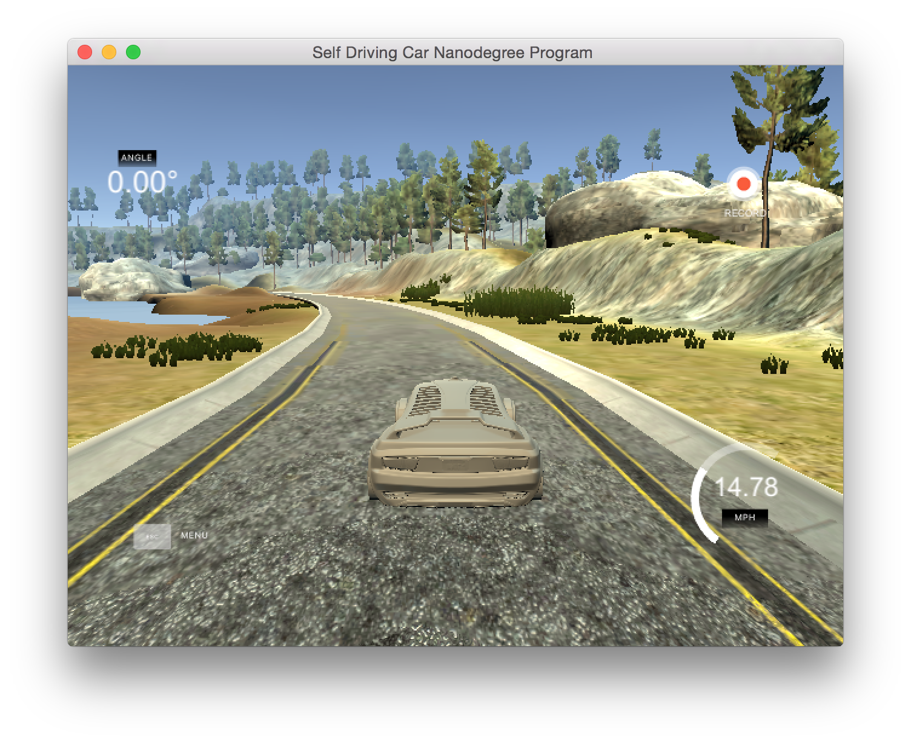
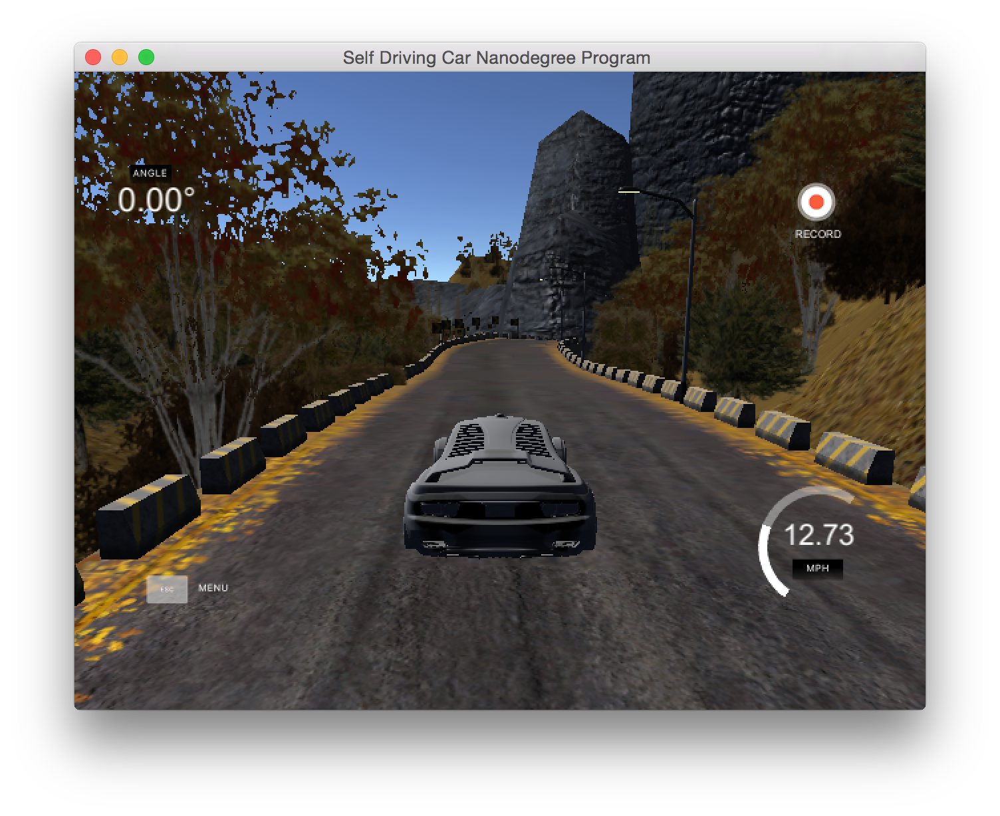
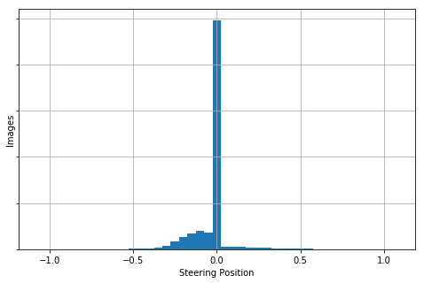
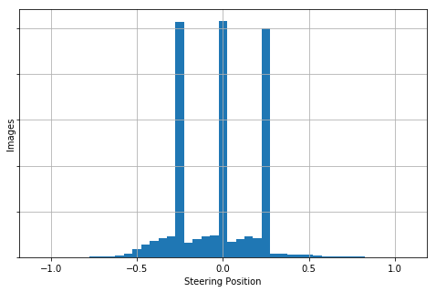
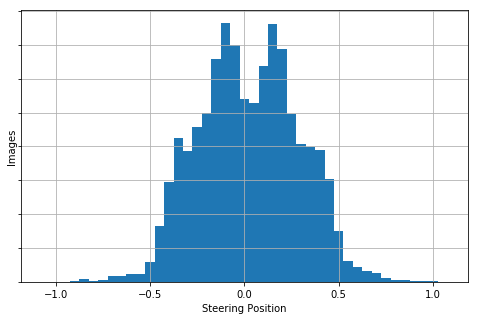
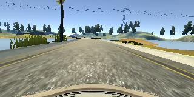
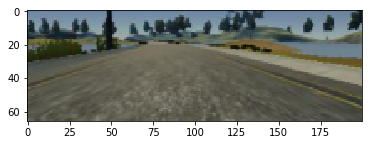
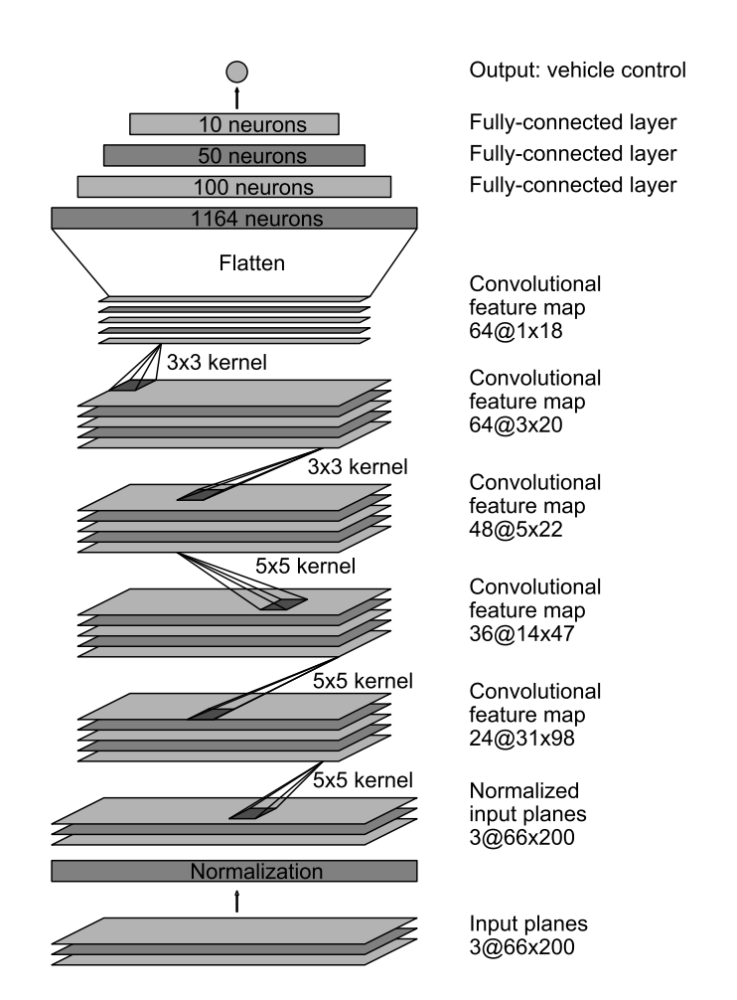

# Behavioural Cloning
### Udacity Self-Driving Car Nanodegree, Project 3
---

### Overview

The objective of this project was to develop a model to clone human driving behaviour while driving a car around a simulated track. The implementation in this repository uses a Deep Convolutional Neural Network to predict the steering angle for each frame generated by the driving simulator. The model preprocessing steps and architecture presented here were heavily influenced by the following two papers from [Nvidia](https://images.nvidia.com/content/tegra/automotive/images/2016/solutions/pdf/end-to-end-dl-using-px.pdf) and [Comma.ai](https://arxiv.org/pdf/1608.01230v1.pdf).

---
### Data Processing

#### Training data
The Udacity simulator provides two tracks to experiment with both generating training data and evaluating the autonomous driving predictions of the model. For this model, training data was only recorded on track 1 of the simulator. Track 2 was reserved for evaluating the trained model's ability to generalize to a new track with completely different colours, lane markings, hills, turns, and other features.

Track 1 screenshot:

Track 2 screenshot:

Training data is recorded by the driving simulator as a set of 160x320 RGB images, three per frame, from three forward-facing cameras sitting left, center, and right on the vehicle's hood. Each frame (set of three images) is labelled with the vehicle's steering angle, throttle value, and brake value recorded from the human inputs.

The total dataset size used to train and validate the model was 104,109 images, representing the left, center, and right images captured for each frame in the simulator on track 1 only.

#### Steering adjustment
The captured steering angle for a given frame is initially the same for the left, center, and right images. Following the approach documented in the Nvidia paper referenced above, to train the vehicle to steer towards the center of each lane, the labels for the left and right images are adjusted by +0.25 and -0.25 respectively.

A visualization of the steering angles before and after this adjustment is presented below:

Before adjustment:

After adjustment:

#### Jittering of Training Data and Resizing of Images
Each image underwent random translation, rotation, and brightness adjustment, which also required adjusting the labelled steering angle given the extent of translation or rotation (e.g., 0.01 steering position adjustment for every pixel of translation).

The histogram of the calculated steering position for a sample of 10,000 jittered images is presented below, along with example before and after images. As you can see, Jittering helped to flatten the distribution of steering positions.

Jittered steering positions (10,000 image sample):

Note that images were cropped to a region of interest and resized to 66x200 pixels in line with the model architecture described below.

An example image before and after jittering and cropping is presented below.

Before:

After:

Validation and Test data (live input from the simulator) was not jittered.

#### Conversion to HSV
Based on empirical testing, the model worked better when using the HSV color space rather than RGB. Jittered training images and unjittered validation images were converted to HSV prior to being input into the model architecture below.

#### Train Validation split
Validation data was randomly split at 25% of the total samples.

### Model Architecture
A Convolutional Neural Network architecture was used that was heavily influenced by both the Nvidia and Comma.ai papers referenced above. Implementation of this model was done in Keras with Tensorflow as a backend. Training was performed on an AWS p2.xlarge instance.

Nvidia CNN architecture used. The size of each layer is specified.

Key parts to the model:
* The first layer was a normalization layer to scale values between -0.5 and 0.5
* Use of ELU activation functions in the hidden layers instead of ReLU because ELU units actually seem to learn faster than other units and they are able to learn models which are at least as good as ReLU-like networks.
* Use of 20% Dropout after each Convolutional and Fully Connected layer in the network. This approach was chosen based on empirical observations; with this high level of dropout, the car generalized much better to areas of Track 1 that did not have certain features like lane markings, and it enabled the car to complete Track 2 from beginning to end.

Implementation considerations:
* Early Stopping and Model Checkpoints were used to ensure that saved models scored the best on both the test and validation set.
* A generator was used to train the network using a lower memory footprint with a sample size of 25,600, validation size of 6400, and batch size of 128.
* Training was performed for 50 epochs

### Result

The vehicle was able to successfully drive around both simulator tracks, mostly keeping to the center of the lane.

Some additional work is required to prevent the car from wobbling within a lane, which may be solved by reducing the number of 0.00 steering examples in the initial dataset, and thus reducing the number of -0.25 and +0.25 steering shifted examples.
